### Hi I'm Vinh.

 

Hi there, I'm Vinh, I'm currently a doctor, being on the journey to become an iOS developer. It's a rough path but also intriguing. 

### Some of my projects:

#   Focus In Nature   &nbsp;&nbsp;&nbsp;&nbsp;&nbsp;  

Frameworks: SwiftUI, AVFounddation, AVKit

Minimalist pomodoro timer, with nature sounds, notification, haptic feedback.

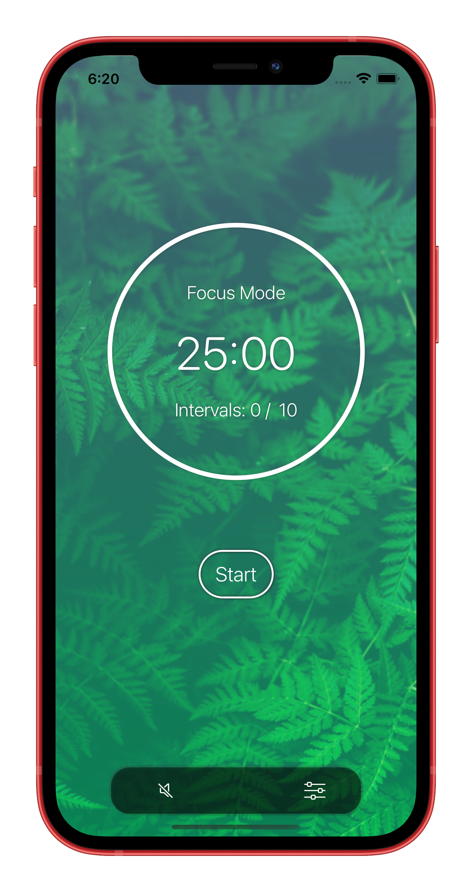&nbsp;&nbsp;&nbsp;&nbsp;&nbsp;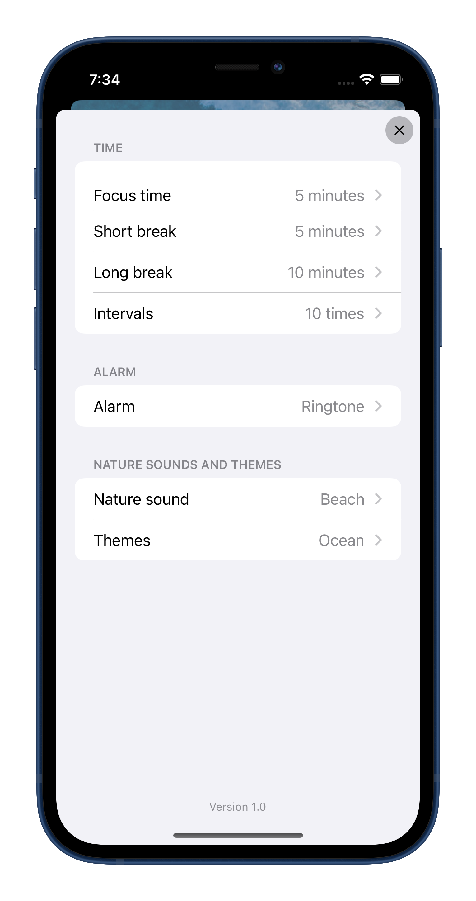&nbsp;&nbsp;&nbsp;

#   Github Followers  &nbsp;&nbsp;&nbsp;&nbsp;&nbsp; 

Frameworks: UIKit

Using github public API, searchable collectionView. When type in username, fetch followers list of the user. Show detail infomation of the follower when tapped. Show github profile button leads to follower profile page using safari view.

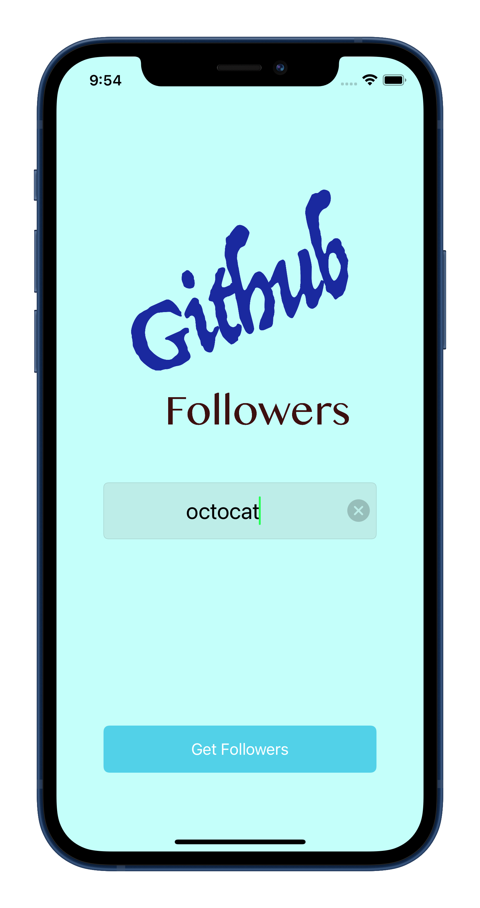&nbsp;&nbsp;&nbsp;&nbsp;&nbsp;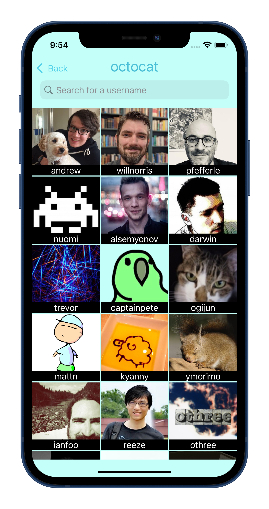
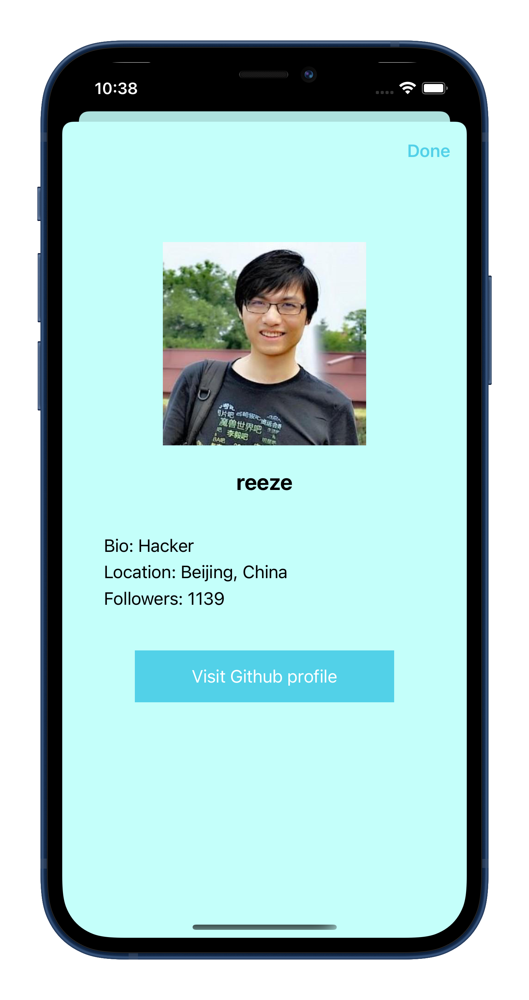&nbsp;&nbsp;&nbsp;&nbsp;&nbsp;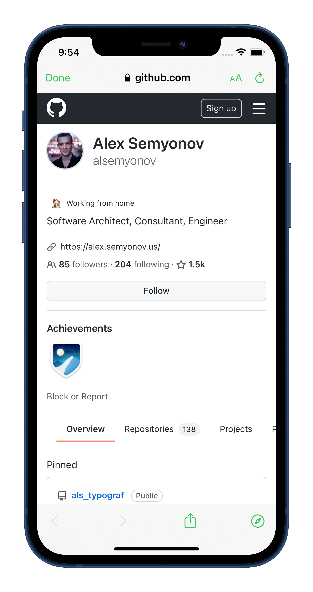

#   Find Weather  &nbsp;&nbsp;&nbsp;&nbsp;&nbsp;  
Frameworks: SwiftUI, CoreLocation

Simple weather app, display the weather the city typed in the search text field by users, or fetch weather data using user's location by tapping in location button at the top leading area.

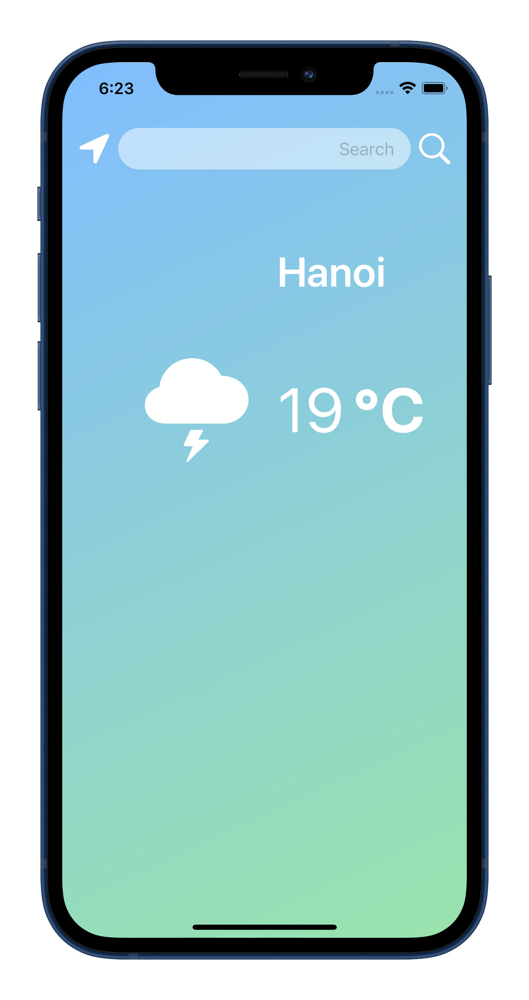&nbsp;&nbsp;&nbsp;&nbsp;&nbsp;

#   LetsFocusPomo  &nbsp;&nbsp;&nbsp;&nbsp;&nbsp; 
Frameworks: SwiftUI, Firebase

Another timer, but add authentication by email. Let users save their settings on Firebase's Firestore.

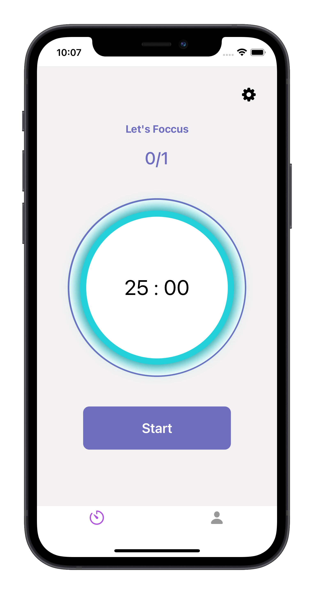&nbsp;&nbsp;&nbsp;&nbsp;&nbsp;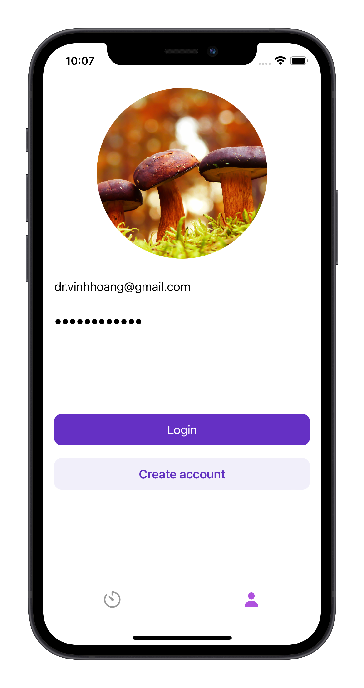
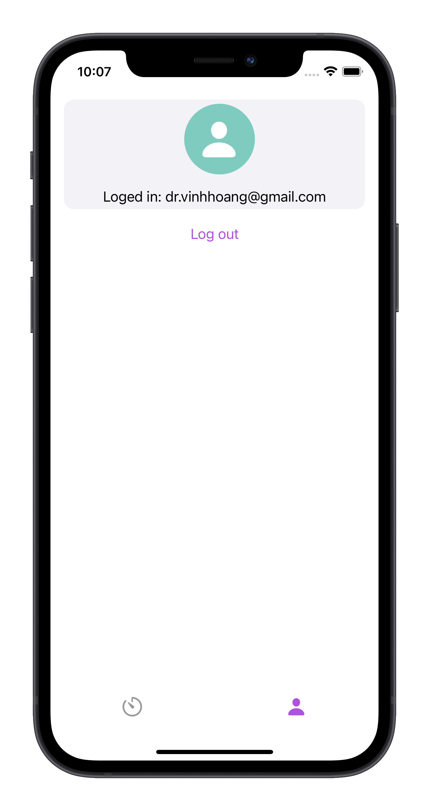&nbsp;&nbsp;&nbsp;&nbsp;&nbsp;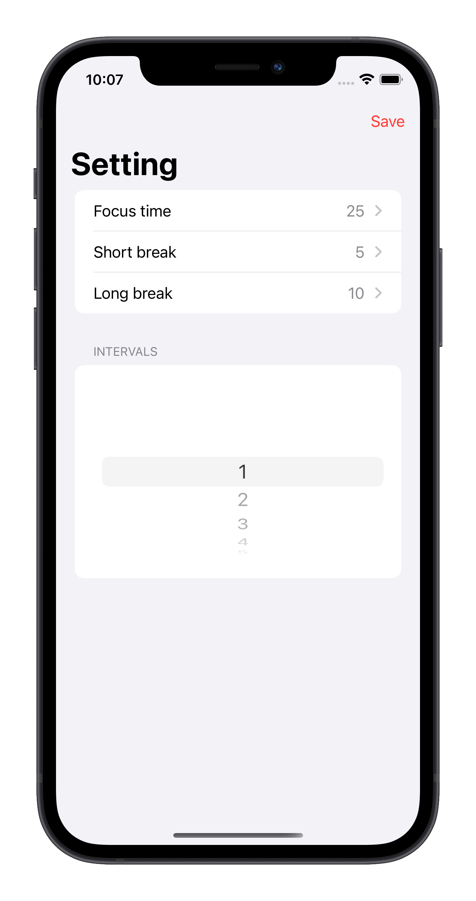

