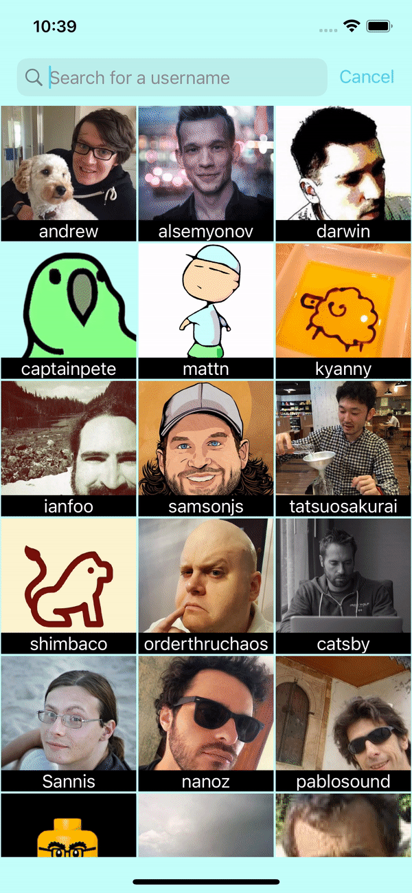

# Hi I'm Vinh.

Hi there, I'm Vinh, I had been working as a doctor for 3 years, I've been an iOS developer for 1 year. Deciding to become a programmer is the wisest decision I've made. 
After a couple of months of working as a developer, I've never regret about making the decision. I've realized that I was born to do this job. And I have a long journey ahead with a bunch of opportunities, all relying on my ability to learn new things, and sharpen my skills. But the most important, I love what I do now.

### Some of my projects I've done when I first started learning iOS programming:

#   Focus In Nature   &nbsp;&nbsp;&nbsp;&nbsp;&nbsp;  

##### SwiftUI, AVFounddation, AVKit, Local notification

Minimalist Pomodoro timer, with nature sounds, local notification, haptic feedback, play sound in the background. This literally a timer for minimalists.
I did this project in 10 days, did everything myself, from design, to publishing to Appstore.  

&nbsp;&nbsp;&nbsp;&nbsp;&nbsp;&nbsp;&nbsp;&nbsp;

#   Github Followers  &nbsp;&nbsp;&nbsp;&nbsp;&nbsp; 

##### UIKit (Interface Builder for UI part), Github public API

Using github public API, searchable collectionView. When type in username, fetch user's list of followers. Show detail infomation of the follower. Show profile page in safari view.

&nbsp;&nbsp;&nbsp;&nbsp;&nbsp;
&nbsp;&nbsp;&nbsp;&nbsp;&nbsp;

#   Find Weather  &nbsp;&nbsp;&nbsp;&nbsp;&nbsp;  
##### SwiftUI, CoreLocation, Open weather API

Simple weather app, display the weather of the city was typed in the search text field by the user, or fetch weather data using user's location by tapping in location button.

&nbsp;&nbsp;&nbsp;&nbsp;&nbsp;

#   PomoFocus  &nbsp;&nbsp;&nbsp;&nbsp;&nbsp; 
##### SwiftUI, Firebase

Another timer, but add email authentication. Let users save their settings on cloud.

&nbsp;&nbsp;&nbsp;&nbsp;&nbsp;&nbsp;&nbsp;&nbsp;&nbsp;&nbsp;

